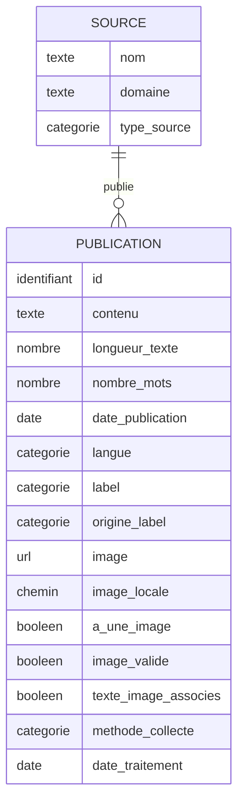

# Schéma conceptuel des données

## Diagramme entité-relation

Cardinalité : une **Source** publie zéro, une ou plusieurs **Publications** ; chaque **Publication** provient d'exactement une **Source**.
